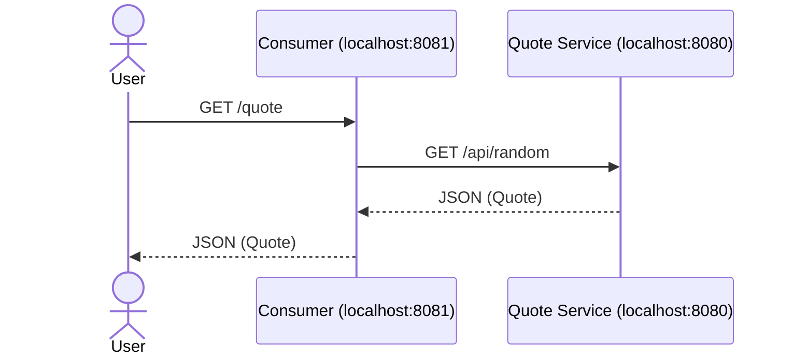

# Consuming a RESTful Web Service

A Spring Boot application that consumes the [quote-service](../03-quote-service) REST API.

Based on [Spring Guide: Consuming a RESTful Web Service](https://spring.io/guides/gs/consuming-rest).

## File Index

```
03-spring-consuming-rest/
├── pom.xml
├── src/main/java/com/example/consumingrest/
│   ├── ConsumingRestApplication.java   # Main entry point
│   ├── QuoteController.java            # REST endpoint, calls quote-service
│   ├── Quote.java                      # Record for JSON response
│   └── Value.java                      # Record for nested JSON object
├── src/main/resources/
│   └── application.properties          # Port config (8081) + quote-service URL
├── src/test/java/com/example/consumingrest/
│   ├── ConsumingRestApplicationTests.java  # Spring context test
│   └── QuoteControllerTest.java            # Endpoint tests with mocked backend
└── docs/
    ├── DEVELOPER_NOTES.md               # My developer notes
    ├── images/                          # Screenshots
    ├── setup/
    │   ├── spring-initializr.md         # Project setup from start.spring.io
    │   └── run-instructions.md          # Detailed run steps
    ├── concepts/
    │   ├── quote-controller.md          # Explains RestClient and the controller
    │   └── java-records.md              # Explains records and JSON mapping
    ├── reference/
    │   └── guide.md                     # Original Spring guide
    └── adr/
        ├── ADR-0003-use-restclient.md   # Why RestClient
        ├── ADR-0004-expose-quote-endpoint.md  # Why REST endpoint
        ├── ADR-0005-error-handling-fallback.md  # Why graceful error handling
        └── ADR-0006-externalize-base-url.md     # Why configurable URL
```

## How It Works

This consumer exposes a `/quote` endpoint that fetches a random quote from the quote-service:



## Run

**Step 1:** Start the quote-service first (in a separate terminal):

```bash
cd ../03-quote-service
./mvnw spring-boot:run
```

**Step 2:** Start this consumer:

```bash
./mvnw spring-boot:run
```

**Step 3:** Fetch a quote:

```bash
curl http://localhost:8081/quote
```

## JSON Response

```json
{
  "type": "success",
  "value": {
    "id": 3,
    "quote": "Spring Boot is the best thing that has happened to Java development in a long time."
  }
}
```

## Terminal output from `curl http://localhost:8081/quote`


## Ports

| Service        | Port |
|----------------|------|
| quote-service  | 8080 |
| consuming-rest | 8081 |

(Port 8081 is set in this module's `application.properties` via `server.port=8081`.)

## Key Concepts

- **RestClient** - Spring Boot 3.2+ HTTP client for making REST calls.
- **Java Records** - Immutable data classes (`Quote`, `Value`).
- **Constructor Injection** - How Spring provides dependencies.
- **@Value** - Inject configuration from `application.properties`.
- **Error Handling** - Graceful fallback when backend is unavailable.
- **@JsonIgnoreProperties** - Ignore unknown JSON fields during deserialization.

## Documentation

| File                                                              | Explains                                    |
|-------------------------------------------------------------------|---------------------------------------------|
| [DEVELOPER_NOTES.md](docs/DEVELOPER_NOTES.md)                     | My developer notes                          |
| [setup/spring-initializr.md](docs/setup/spring-initializr.md)     | Project setup from start.spring.io          |
| [setup/run-instructions.md](docs/setup/run-instructions.md)       | Detailed run steps                          |
| [concepts/quote-controller.md](docs/concepts/quote-controller.md) | How RestClient and the controller work      |
| [concepts/java-records.md](docs/concepts/javarecords.md)          | What records are and how JSON mapping works |
| [reference/guide.md](docs/reference/guide.md)                     | Original Spring guide                       |

## ADRs

| ADR                                                    | Decision                                           |
|--------------------------------------------------------|----------------------------------------------------|
| [ADR-0003](docs/adr/ADR-0003-use-restclient.md)        | Why RestClient instead of RestTemplate             |
| [ADR-0004](docs/adr/ADR-0004-expose-quote-endpoint.md) | Why a REST endpoint instead of ApplicationRunner   |
| [ADR-0005](docs/adr/ADR-0005-error-handling-fallback.md) | Why graceful error handling with fallback        |
| [ADR-0006](docs/adr/ADR-0006-externalize-base-url.md)  | Why externalize the quote-service URL              |

## Related

- [03-quote-service](../03-quote-service) - The backend this consumer calls
- [Spring Guide: Consuming a RESTful Web Service](https://spring.io/guides/gs/consuming-rest)
- [Spring Docs: REST Clients](https://docs.spring.io/spring-boot/reference/io/rest-client.html)
