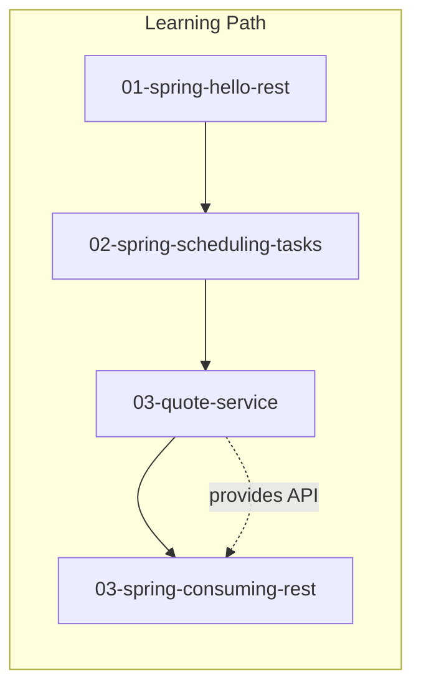

# java-tutorials-spring

[](https://github.com/jguida941/java-spring-tutorials/actions/workflows/java-ci.yml)
[](https://github.com/jguida941/java-spring-tutorials)
[](https://github.com/jguida941/java-spring-tutorials)
[](https://github.com/jguida941/java-spring-tutorials)

This repository contains hands-on implementations of the official [Spring Guides](https://spring.io/guides), along with detailed architectural breakdowns explaining the "what" and "why" behind the code.

Each subfolder is a small, focused project generated with Spring Initializr.

## Objective

The goal of this repo is to:
- Teach others how to use Spring Initializr effectively
- Provide reusable templates with detailed documentation
- Document all major components in easy-to-understand language
- Create personal notes that can be referenced alongside Spring documentation

I believe in understanding over memorization. Every aspect is documented with explanations of why decisions were made.

## Architecture Overview



## Contents

| Module | Guide | Status | Spring Concepts |
|--------|-------|--------|-----------------|
| `01-spring-hello-rest` | [REST Service](https://spring.io/guides/gs/rest-service/) | Implemented | @RestController, records, JSON |
| `02-spring-scheduling-tasks` | [Scheduling Tasks](https://spring.io/guides/gs/scheduling-tasks/) | Implemented | @Scheduled, @EnableScheduling |
| `03-quote-service` | [Consuming REST](https://spring.io/guides/gs/consuming-rest/) | Implemented | REST API provider, List.of() |
| `03-spring-consuming-rest` | [Consuming REST](https://spring.io/guides/gs/consuming-rest/) | Implemented | RestClient, @Value |

More guides will be added over time.

## Quick Start

See [docs/QUICK_START.md](docs/QUICK_START.md) for run instructions.

```bash
cd <module-folder>
./mvnw spring-boot:run
```

## Enhancements Beyond Official Spring Guides

For some modules I extended the original guide examples:

- **02-spring-scheduling-tasks:**
  - Added integration test verifying scheduled method runs using Awaitility and `@MockitoSpyBean`

- **03-quote-service:**
  - Reimplemented the sample quote backend as a standalone Spring Boot app
  - Added tests for `/api/`, `/api/random`, and `/api/{id}`
  - Fixed thread-safety issue with random quote selection (ThreadLocalRandom)

- **03-spring-consuming-rest:**
  - Used modern `RestClient` instead of deprecated `RestTemplate`
  - Added `/quote` endpoint that calls backend on demand
  - Added error handling and externalized configuration for backend URL

## Module Layout

```
module-name/
├── src/main/java/              # Source code
├── src/test/java/              # Tests
├── docs/
│   ├── setup/                  # How to create and run the project
│   ├── concepts/               # Explanations of key classes and patterns
│   └── reference/              # Original Spring guide (where applicable)
├── pom.xml                     # Maven configuration
└── README.md                   # Overview and documentation index
```

The 03 modules also include:
- `docs/DEVELOPER_NOTES.md` - Personal notes and detailed explanations
- `docs/adr/` - Architecture Decision Records documenting the "why" behind design choices

## Documentation

| Document | Purpose |
|----------|---------|
| [docs/QUICK_START.md](docs/QUICK_START.md) | Run instructions for all modules |
| [docs/project.md](docs/project.md) | Audit summary and backlog |
| [docs/CI_PLAN.md](docs/CI_PLAN.md) | CI/CD quality gates and thresholds |
| [docs/adr/](docs/adr/) | Repository-level ADRs |
| Module `docs/adr/` | Module-specific ADRs |
| Module `docs/concepts/` | Deep dives on patterns |

## Technology Stack

- **Spring Boot 4.0.0** (Spring Framework 7)
- **Java 17**
- **Maven** with multi-module parent POM

## Testing

Run all tests from repo root (uses aggregator POM):
```bash
./mvnw test
```

Run a single module:
```bash
./mvnw test -pl modules/03-quote-service
```

## CI/CD

This repository uses GitHub Actions for continuous integration:

| Tool | Purpose | Threshold |
|------|---------|-----------|
| **Checkstyle** | Code style | Fail on violation |
| **SpotBugs** | Static analysis | Fail on error |
| **PITest** | Mutation testing | 70% mutation score |
| **OWASP** | Dependency security | Fail on CVSS ≥ 7 |
| **CodeQL** | SAST scanning | Weekly + PR |

See [docs/CI_PLAN.md](docs/CI_PLAN.md) for details.

## Related Resources

- [Spring Guides](https://spring.io/guides)
- [Spring Boot Reference](https://docs.spring.io/spring-boot/docs/current/reference/html/)
- [Spring Initializr](https://start.spring.io/)
