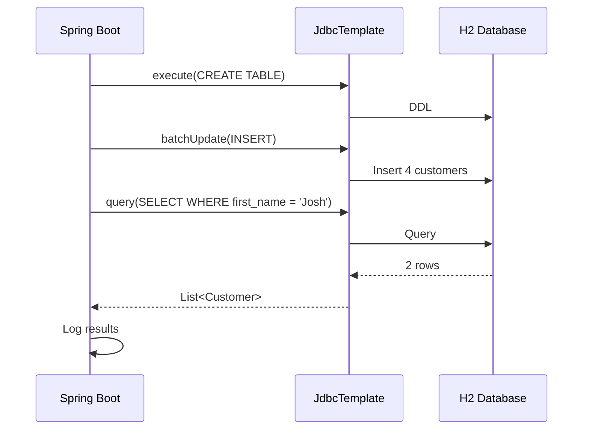

# Relational Data Access with Spring JDBC

[](https://github.com/jguida941/java-spring-tutorials)
[](https://github.com/jguida941/java-spring-tutorials)

A Spring Boot console application that demonstrates JdbcTemplate for database operations with H2.

Based on [Spring Guide: Accessing Relational Data using JDBC with Spring](https://spring.io/guides/gs/relational-data-access/).

## File Index

```
04-spring-relational-data-access/
├── pom.xml
├── src/main/java/com/example/relationaldataaccess/
│   ├── RelationalDataAccessApplication.java   # Main entry point with CommandLineRunner
│   └── Customer.java                          # Record for customer data
├── src/main/resources/
│   └── application.properties                 # H2 auto-configured (no config needed)
├── src/test/java/com/example/relationaldataaccess/
│   └── RelationalDataAccessApplicationTests.java  # Spring context test
└── docs/
    ├── DEVELOPER_NOTES.md                     # My developer notes
    ├── images/                                # Screenshots
    ├── setup/
    │   ├── spring-initializr.md               # Project setup from start.spring.io
    │   └── run-instructions.md                # Detailed run steps
    ├── concepts/
    │   ├── jdbc-template.md                   # Explains JdbcTemplate and the main app
    │   └── customer.md                        # Explains the Customer record
    ├── reference/
    │   └── guide.md                           # Original Spring guide
    └── adr/                                   # Architecture Decision Records (empty for now)
```

## How It Works

This is a console application that runs once and exits. It uses `CommandLineRunner` to execute database operations on startup:



## Run

```bash
./mvnw spring-boot:run
```

No external database needed - H2 in-memory database is auto-configured.

## Console Output

```
  .   ____          _            __ _ _
 /\\ / ___'_ __ _ _(_)_ __  __ _ \ \ \ \
( ( )\___ | '_ | '_| | '_ \/ _` | \ \ \ \
 \\/  ___)| |_)| | | | | || (_| |  ) ) ) )
  '  |____| .__|_| |_|_| |_\__, | / / / /
 =========|_|==============|___/=/_/_/_/

 :: Spring Boot ::                (v4.0.0)

... INFO ... RelationalDataAccessApplication : Creating tables
... INFO ... HikariDataSource       : HikariPool-1 - Start completed.
... INFO ... RelationalDataAccessApplication : Inserting customer record for John Woo
... INFO ... RelationalDataAccessApplication : Inserting customer record for Jeff Dean
... INFO ... RelationalDataAccessApplication : Inserting customer record for Josh Bloch
... INFO ... RelationalDataAccessApplication : Inserting customer record for Josh Long
... INFO ... RelationalDataAccessApplication : Querying for customer records where first_name = 'Josh':
... INFO ... RelationalDataAccessApplication : Customer[id=3, firstName='Josh', lastName='Bloch']
... INFO ... RelationalDataAccessApplication : Customer[id=4, firstName='Josh', lastName='Long']
```

## Terminal Output


## Key Concepts

- **JdbcTemplate** - Spring's helper class for SQL operations, handles connections and errors.
- **CommandLineRunner** - Interface that runs code after Spring Boot starts.
- **Java Records** - Immutable data class (`Customer`) for holding database rows.
- **Constructor Injection** - How Spring provides the JdbcTemplate dependency.
- **RowMapper Lambda** - Converts `ResultSet` rows into Java objects.
- **Batch Update** - Efficiently inserts multiple rows in one database call.
- **H2 Database** - In-memory database auto-configured by Spring Boot.

## Documentation

| File                                                          | Explains                                      |
|---------------------------------------------------------------|-----------------------------------------------|
| [DEVELOPER_NOTES.md](docs/DEVELOPER_NOTES.md)                 | My developer notes (Phase 1 & 2)              |
| [setup/spring-initializr.md](docs/setup/spring-initializr.md) | Project setup from start.spring.io            |
| [setup/run-instructions.md](docs/setup/run-instructions.md)   | Detailed run steps                            |
| [concepts/jdbc-template.md](docs/concepts/jdbc-template.md)   | JdbcTemplate methods and main application     |
| [concepts/customer.md](docs/concepts/customer.md)             | Customer record, @Override, String.format     |
| [reference/guide.md](docs/reference/guide.md)                 | Original Spring guide                         |

## JdbcTemplate Methods Used

| Method | Purpose |
|--------|---------|
| `execute(sql)` | Run DDL (CREATE TABLE, DROP TABLE) |
| `batchUpdate(sql, list)` | Insert multiple rows efficiently |
| `query(sql, rowMapper, params)` | Select rows and map to objects |

## Notes

- **Console only** - No web server, no HTTP endpoints
- **In-memory database** - Data is lost when the app stops
- **Port** - N/A (not a web application)

## Related

- [Spring Guide: Accessing Relational Data using JDBC with Spring](https://spring.io/guides/gs/relational-data-access/)
- [Spring Docs: JdbcTemplate](https://docs.spring.io/spring-framework/reference/data-access/jdbc/core.html)