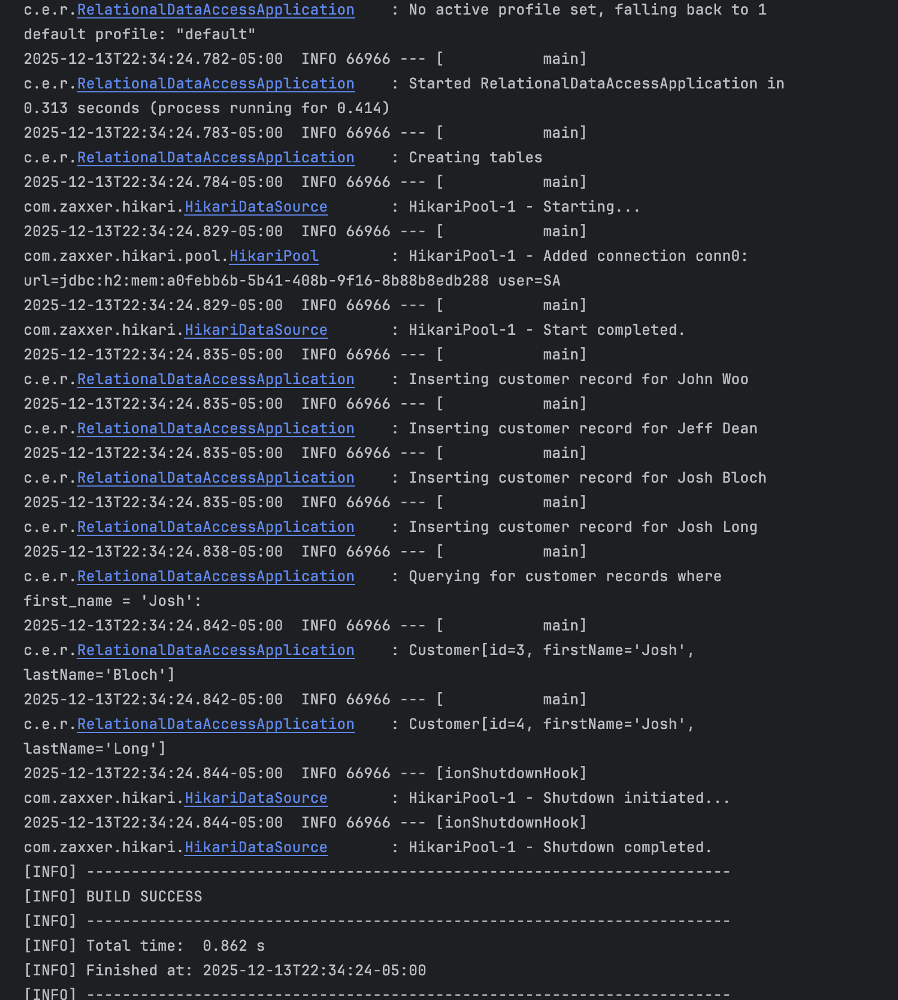

# Run Instructions

## Prerequisites

- Java 17 or later
- Maven (or use the included `./mvnw` wrapper)

No external database setup needed - the app uses H2 in-memory database which is auto-configured.

## Run the Application

From the module directory:

```bash
./mvnw spring-boot:run
```

Or from the repository root:

```bash
./mvnw spring-boot:run -pl modules/04-spring-relational-data-access
```

## Expected Output

The app runs once and exits. You should see:



```
  .   ____          _            __ _ _
 /\\ / ___'_ __ _ _(_)_ __  __ _ \ \ \ \
( ( )\___ | '_ | '_| | '_ \/ _` | \ \ \ \
 \\/  ___)| |_)| | | | | || (_| |  ) ) ) )
  '  |____| .__|_| |_|_| |_\__, | / / / /
 =========|_|==============|___/=/_/_/_/

 :: Spring Boot ::                (v4.0.0)

... INFO ... RelationalDataAccessApplication : Creating tables
... INFO ... HikariDataSource       : HikariPool-1 - Starting...
... INFO ... HikariPool             : HikariPool-1 - Added connection conn0: url=jdbc:h2:mem:...
... INFO ... HikariDataSource       : HikariPool-1 - Start completed.
... INFO ... RelationalDataAccessApplication : Inserting customer record for John Woo
... INFO ... RelationalDataAccessApplication : Inserting customer record for Jeff Dean
... INFO ... RelationalDataAccessApplication : Inserting customer record for Josh Bloch
... INFO ... RelationalDataAccessApplication : Inserting customer record for Josh Long
... INFO ... RelationalDataAccessApplication : Querying for customer records where first_name = 'Josh':
... INFO ... RelationalDataAccessApplication : Customer[id=3, firstName='Josh', lastName='Bloch']
... INFO ... RelationalDataAccessApplication : Customer[id=4, firstName='Josh', lastName='Long']
```

## Run Tests

```bash
./mvnw test -pl modules/04-spring-relational-data-access
```

## What's Happening

1. **Spring Boot starts** and auto-configures H2 in-memory database
2. **Table created** - `customers` table with id, first_name, last_name
3. **Data inserted** - 4 customer records via batch insert
4. **Query executed** - finds customers where first_name = 'Josh'
5. **Results logged** - prints the 2 matching customers
6. **App exits** - CommandLineRunner completes, app shuts down

## Notes

- **No web server** - this is a console application, no HTTP endpoints
- **In-memory database** - data is lost when the app stops
- **Port** - N/A (console only)

## Troubleshooting

| Problem | Solution |
|---------|----------|
| `java: command not found` | Install Java 17+ |
| Build fails | Run `./mvnw clean` first |
| Different output | Check you're on the right branch |
